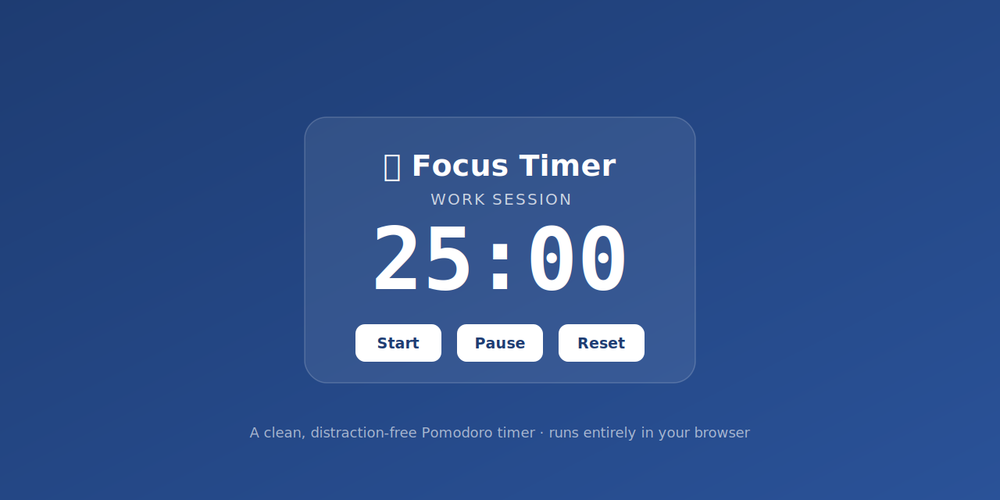

# ⏱️ Focus Timer

A clean, distraction-free **Pomodoro timer** that runs entirely in your browser. No installs, no accounts, no tracking — just open it and focus.

🔗 **[Try it live](https://aashishbharti04.github.io/focus-timer/)**

## ✨ Features
- Work / break / long-break cycles (Pomodoro technique)
- **Circular progress ring** around the countdown
- **Customizable durations** — set your own work, break and long-break lengths (saved in your browser)
- **Automatic long break** after every 4 Pomodoros
- **Session counter** that remembers how many Pomodoros you've completed
- **Completion chime** and optional desktop notifications
- **Focus task label** — note what you're working on (remembered across reloads)
- Start, pause, reset, and a <kbd>Space</kbd> start/pause shortcut
- Live countdown in the browser tab
- Clean, responsive design for phone and desktop
- 100% offline — no dependencies, no build step, no tracking

## 🚀 Usage
Open `index.html` in any browser, or use the hosted version on GitHub Pages.

## 🤝 Contributing
Contributions are welcome! Open an issue or send a pull request.

## 📄 License
Released under the MIT License — see [LICENSE](LICENSE).
